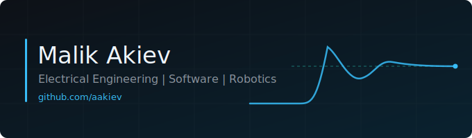

  

I'm a robotics and hardware engineer at **[Tario Marine Technologies](https://tariomarine.com)** in Toronto, building autonomous surface vessel (ASV) hardware across mechanics, electronics, and control software. Before Toronto I graduated top of my year in Electrical Engineering (Automation Technology) and published first-author research on physics-based modeling of compressor performance maps.

---

## Publications

- **[Physics-based Approximation and Prediction of Speedlines in Compressor Performance Maps](https://arxiv.org/abs/2603.11317)** · arXiv:2603.11317 (2026) · First Author

A physics-based method for reconstructing compressor performance maps from sparse measurements. Each speedline is fit with a superellipse and encoded as a compact, interpretable vector (surge, choke, curvature, shape), then used to interpolate and extrapolate unmeasured speedlines. Validated on industrial turbocharger data. Code: [spotspeedlines](https://github.com/sequential-parameter-optimization/spotspeedlines).

---

## Featured Projects

- **[NeuralNetwork-WPF](https://github.com/aakiev/NeuralNetwork-WPF)**: A neural network built from scratch in C#, with a WPF interface for image recognition. No ML framework, just the math implemented directly. `C#` `WPF`
- **[Dynamic-System-Optimization](https://github.com/aakiev/Dynamic-System-Optimization)**: Python implementations of dynamic-system optimization methods written for transparency: ARX modeling, linear programming, particle swarm optimization, and genetic algorithms, each coded manually rather than pulled from a package. `Python`
- **[SVM-Optimization-PSO](https://github.com/aakiev/SVM-Optimization-PSO)**: A support vector machine tuned with particle swarm optimization for hyperparameter search, improving classification accuracy on the Maternal Health Risk dataset. `Python`
- **[Robotics-AutonomousDriving](https://github.com/aakiev/Robotics-AutonomousDriving)**: Hardware and software integration for autonomous vehicle navigation in ROS2, from the university robotics module. `Python` `C++` `ROS2`

---

## Research and Engineering

**Bachelor Thesis · Bosch Manufacturing Solutions, Stuttgart** (Sep 2025 - Feb 2026)
*Beam quality optimization in dynamic laser beam shaping using neural networks.*
Built a neural-network approach in Python and TensorFlow to model real optical light propagation for dynamic laser beam shaping. Designed and ran the experiments on a Bosch prototype myself: camera-based calibration, data acquisition, and optical measurements.

**Research and Software Engineering Intern · Bosch Manufacturing Solutions, Stuttgart** (Mar 2025 - Aug 2025)
Software for a dynamic laser beam shaping prototype: Python backend, C# frontend, gRPC interface. Reviewed and qualified current publications and dissertations, and ran lab experiments to refine the software and the algorithms behind it.

---

## Tech Stack

  

---

## Education and Honors

**B.Eng. Electrical Engineering · Automation Technology**
Cologne University of Applied Sciences (TH Köln), Gummersbach, Germany · Oct 2022 - Feb 2026
GPA equivalent 3.8/4.0 (German grade 1.4)

- Best graduate of the year
- Germany National Scholarship (Deutschlandstipendium)
- Student member, Examination Board (Department of Electrical Engineering) and Appointment Committee
- Core coursework: Python, C++, Software Engineering, Robotics, Control Engineering

---

## Connect

  
  
  

